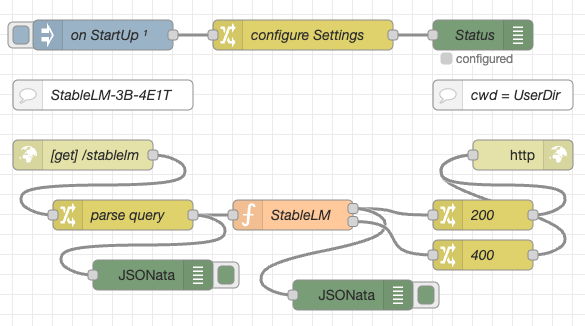

# node-red-flow-stablelm-3b-4e1t

Node-RED Flows for the StableLM-3B-4E1T AI model

This repository contains a function node for [Node-RED](https://nodered.org/) which can be used to run the [Stability AI](https://huggingface.co/stabilityai) [StableLM-3B-4E1T model](https://huggingface.co/stabilityai/stablelm-3b-4e1t) using [llama.cpp](https://github.com/rozek/llama.cpp) within a Node-RED flow. **Inference is done on the CPU** (without requiring any special harware) and still completes within a few seconds on a reasonably powerful computer.



Additionally, this repo also contains function nodes to tokenize a prompt or to calculate embeddings based on the StableLM-3B-4E1T model.

Having the inference, tokenization and embedding calculation as a self-contained function node gives you the possibility to create your own user interface or even use it as part of an autonomous agent.

> Nota bene: these flows do not contain the actual model. You will have to download your own copy directly from [Huggingface](https://huggingface.co/rozek/StableLM-3B-4E1T_GGUF) (use file [stablelm-3b-4e1t-Q8_K.bin](https://huggingface.co/rozek/StableLM-3B-4E1T_GGUF/blob/main/stablelm-3b-4e1t-Q8_K.bin)).

> Just a small note: if you like this work and plan to use it, consider "starring" this repository (you will find the "Star" button on the top right of this page), so that I know which of my repositories to take most care of.

## Installation ##

This section shows you how to install Node.js, Node-RED, LLaMA.cpp and the flows from this repository - feel free to skip the steps for those components you already installed before.

### Node.js ###

"_[Node.js](https://nodejs.org/en) is a cross-platform, open-source server environment that can run on Windows, Linux, Unix, macOS, and more. Node.js is a back-end JavaScript runtime environment, runs on the V8 JavaScript engine, and executes JavaScript code outside a web browser._" (according to [Wikipedia](https://en.wikipedia.org/wiki/Node.js))

Start by [installing Node.js](https://nodejs.org/en) as described on their web page.

### Node-RED ###

"_[Node-RED](https://nodered.org/) is a flow-based, low-code development tool for visual programming developed originally by IBM..._" (according to [Wikipedia](https://en.wikipedia.org/wiki/Node-RED))

If not already done, install Node-RED as described on their "[Get Started](https://nodered.org/#get-started)" page.

### LLaMA.cpp ###

[LLaMA.cpp](https://github.com/ggerganov/llama.cpp) is a port of Facebook's LLaMA model in C/C++ (don't let you fool by the statement that the "_main goal of llama.cpp is to run the LLaMA model using 4-bit integer quantization on a MacBook_" - LLaMA.cpp runs just as well under Windows and Linux)

> Note: please use my own fork of the original LLaMA.cpp as the code in there raises the context limit and contains additional functions for tokenization - however, if you are fine with a context length of up to 4096 tokens and don't want to tokenize any prompts, the original code will work as fine

Get the code as follows:

```
git https://github.com/rozek/llama.cpp
cd llama.cpp
```

Then continue as described in the [LLaMA.cpp docs](https://github.com/rozek/llama.cpp#build)

Afterwards, rename the executables

* `main` to `llama`,
* `tokenization` to `llama-tokens` and
* `embedding` to `llama-embeddings`

and copy them into the Node-RED "User Directory" (by default, this folder is located at `$HOME/.node-red`).

### StableLM-3B-4E1T Flows ###

If not already done, download the [8-bit quantization of the StableLM-3B-4E1T model](https://huggingface.co/rozek/StableLM-3B-4E1T_GGUF/blob/main/stablelm-3b-4e1t-Q8_K.bin) into the same folder that already contains your executables.

> Nota bene: right now, the flows from this repository support the given model file only - if you prefer another one, you may simply change the model file name in the function nodes for text completion, tokenization and embeddings calculation.

Now import the desired nodes and flows - if you want them all, just import file [StableLM-3B-4E1T-Flows.json](https://raw.githubusercontent.com/rozek/node-red-flow-stablelm-3b-4e1t/master/StableLM-3B-4E1T-Flows.json).

If you are new to Node-RED, [just follow the instructions from their docs](https://nodered.org/docs/user-guide/editor/workspace/import-export).

## Configuration ##

By default, all StableLM-3B-4E1T function nodes expect their executables (and the model itself) in the folder `$HOME/.node-red` (where `$HOME` is the user's home directory)

If you prefer to store everything in a different folder, simply edit the "configure Settings" node from [StableLM-3B-4E1T-Flows.json](https://raw.githubusercontent.com/rozek/node-red-flow-stablelm-3b-4e1t/master/StableLM-3B-4E1T-Flows.json) and set `globals.UserDir` to the fully qualified path of the directory you chose.

## Function Node Usage ##

All function nodes expect their parameters as properties of the msg object. The prompt itself (or the input text to tokenize or calculate embeddings from) is expected in `msg.payload` and will later be replaced by the function result.

All properties (except prompt or input text) are optional. If given, they should be strings (even if they contain numbers), this makes it simpler to extract them from an HTTP request.

### Text Completion Node ###

Text completion supports the following properties:

* `payload` - this is the actual prompt 
* `seed` - seed value for the internal pseudo random number generator (integer, default: -1, use random seed for <= 0)
* `threads` - number of threads to use during computation (integer ≧ 1, default: 4)
* `context` - size of the prompt context (0...4096, default: 512)
* `keep` - number of tokens to keep from the initial prompt (integer ≧ -1, default: 0, -1 = all)
* `predict` - number of tokens to predict (integer ≧ -1, default: 128, -1 = infinity)
* `topk` - top-k sampling limit (integer ≧ 1, default: 40)
* `topp` - top-p sampling limit (0.0...1.0, default: 0.9)
* `temperature` - temperature (0.0...2.0, default: 0.8)
* `batches` - batch size for prompt processing (integer ≧ 1, default: 8)

### Tokenization Node ###

Tokenization supports the following properties:

* `payload` - this is the actual input text 
* `threads` - number of threads to use during computation (integer ≧ 1, default: 4)
* `context` - size of the prompt context (0...4096, default: 512)

### Embeddings Node ###

Embeddings calculation supports the following properties:

* `payload` - this is the actual input text  
* `seed` - seed value for the internal pseudo random number generator (integer, default: -1, use random seed for <= 0)
* `threads` - number of threads to use during computation (integer ≧ 1, default: 4)
* `context` - size of the prompt context (0...4096, default: 512)

## HTTP Endpoint Usage ##

Besides the sole function nodes for

* [text completion](https://raw.githubusercontent.com/rozek/node-red-flow-stablelm-3b-4e1t/master/StableLM-3B-4E1T-Completion-Function.json),
* [tokenization](https://raw.githubusercontent.com/rozek/node-red-flow-stablelm-3b-4e1t/master/StableLM-3B-4E1T-Tokenization-Function.json) and
* [embeddings calculation](https://raw.githubusercontent.com/rozek/node-red-flow-stablelm-3b-4e1t/master/StableLM-3B-4E1T-Embeddings-Function.json)

this repository also contains example flows which answer incoming HTTP requests. The prompt itself and any desired parameters have to be passed as query parameters, the result of the called function will then be returned in the body of the HTTP response.

For inferencing, the following parameters are supported (most of them will be copied into a `msg` property of the same name):

* `prompt` - will be copied into `msg.payload`
* `seed` - will be copied into `msg.seed`
* `threads` - will be copied into `msg.threads`
* `context` - will be copied into `msg.context`
* `keep` - will be copied into `msg.keep`
* `predict` - will be copied into `msg.predict`
* `topk` - will be copied into `msg.topk`
* `topp` - will be copied into `msg.topp`
* `temperature` - will be copied into `msg.temperature`
* `batches` - will be copied into `msg.batches`

Tokenization and embeddings calculation endpoints support a subset of these parameters - as required by their respective function nodes.

## Examples ##

If you have [cURL](https://curl.se/) installed (if not - but you want it - just [follow the instructions found in their docs](https://everything.curl.dev/get)) (and assuming that your Node-RED installation is listening at port 1880) you may use the following commands to "smoke test" the imported flows:

### Text Completion ###

```
curl "http://127.0.0.1:1880/stablelm?prompt=who%20was%20Joseph%20Weizenbaum%3F"
```

### Tokenization ###

```
curl "http://127.0.0.1:1880/stablelm-tokenization?prompt=who%20was%20Joseph%20Weizenbaum%3F"
```

### Embeddings Calculation ###

```
curl "http://127.0.0.1:1880/stablelm-embeddings?prompt=who%20was%20Joseph%20Weizenbaum%3F"
```

## License ##

[MIT License](LICENSE.md)
