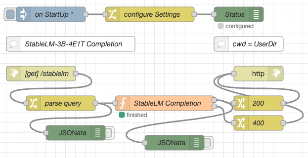

# node-red-flow-stablelm-3b-4e1t

Node-RED Flows for the StableLM-3B-4E1T AI model

This repository contains a function node for [Node-RED](https://nodered.org/) which can be used to run the [Stability AI](https://huggingface.co/stabilityai) [StableLM-3B-4E1T model](https://huggingface.co/stabilityai/stablelm-3b-4e1t) using [llama.cpp](https://github.com/rozek/llama.cpp) within a Node-RED flow. **Inference is done on the CPU** (without requiring any special harware) and still completes within a few seconds on a reasonably powerful computer.

## License ##

[MIT License](LICENSE.md)
